こんにちは、Power Platform サポートチームの網野です。  
本記事では承認コネクタを通じた承認フローにおいて問題が発生した場合の確認手順および情報取得手順についてご案内致します。

<!-- more -->
## 目次

1. [概要](#intro)
1. [ケース別](#required-information)
    1. [承認アクションでエラーが発生した](#approval-error)
    1. [承認通知が届かない／承認メールが遅延して届いた](#approval-no-notification)
    1. [承認作業をしたが、承認アクションが承認中のままになっている](#approval-in-progress)
    1. [承認メールが二重に届いた](#approval-delay)
    1. [承認メールの表示が異なる](#approval-mail-view)
1. [承認用お問い合わせ情報取得手順](#required-information)
      1. [承認アクションのスクリーンショット](#error-in-approval)
      1. [Power Automate ポータルの承認一覧のスクリーンショット](#error-in-approval)

## 概要

Power Automate から作成した承認に関するトラブルシューティングの方法についてご案内致します。  
Teams 承認アプリから作成した承認については、本記事の対象外となります。

## ケース別

### ◆ 承認アクションでエラーが発生した

#### 確認手順
[公開情報](https://support.microsoft.com/ja-jp/topic/%E3%83%95%E3%83%AD%E3%83%BC%E6%89%BF%E8%AA%8D%E3%82%92%E4%BD%9C%E6%88%90%E3%81%97%E3%81%A6%E5%89%B2%E3%82%8A%E5%BD%93%E3%81%A6%E3%82%8B%E3%81%A8%E3%81%8D%E3%81%AE%E4%B8%80%E8%88%AC%E7%9A%84%E3%81%AA%E3%82%A8%E3%83%A9%E3%83%BC-78456797-a0ba-42c2-9ec6-2de209991bac)に承認アクションで発生する一般的なエラーをまとめていますので、エラーメッセージから該当するエラーがあるかご確認ください。  

1. アクションを展開しエラーコードを確認します。  
   下記エラーが出る場合は、"InvalidApprovalCreateRequestAssignedToMissing"がエラーコードとなります。  
  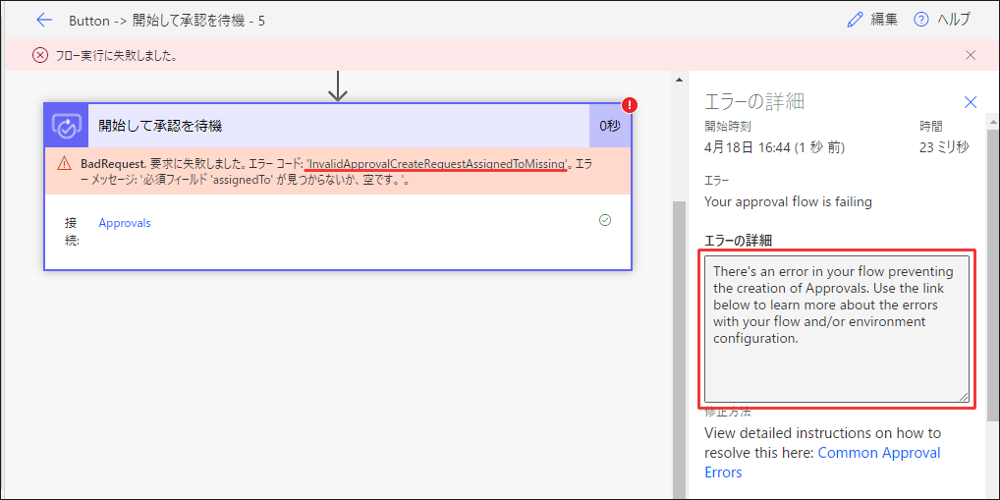
1. 公開情報をエラーコードで検索し、 記載されている対応を行います。
1. 公開情報に記載がない、またはエラーが解消されない場合はサポートチームまでお問い合わせください。

#### お問い合わせいただく場合

| 必要な情報 | 
| --- | 
| エラーが発生した[フロー実行履歴URL](https://jpdynamicscrm.github.io/blog/powerautomate/helpful-information-for-powerautomate-sr/#%E3%83%95%E3%83%AD%E3%83%BC%E5%AE%9F%E8%A1%8C%E5%B1%A5%E6%AD%B4URL)  | 
| [実行履歴に表示されるエラーメッセージ](https://jpdynamicscrm.github.io/blog/powerautomate/helpful-information-for-powerautomate-sr/#%E5%AE%9F%E8%A1%8C%E5%B1%A5%E6%AD%B4%E3%81%AB%E8%A1%A8%E7%A4%BA%E3%81%95%E3%82%8C%E3%82%8B%E3%82%A8%E3%83%A9%E3%83%BC%E3%83%A1%E3%83%83%E3%82%BB%E3%83%BC%E3%82%B8)  | 
| 承認者のUPN／ログインメールアドレス | 
  

    
### ◆ 承認通知が届かない / 承認メールが遅延して届いた場合
#### 確認手順
はじめに 申請者または承認者で[Power Automateポータル](#screenshot-of-approval-in-portal) にアクセスし、承認リクエストが作成されているかご確認ください。

**【ポータル】Power Automate ポータルにて承認が作成されていない場合** 
1. フローの実行履歴を確認し、承認アクションが実行中になっているかご確認ください。
1. 承認アクションが実行されている場合、承認作成時に内部エラーが発生している可能性がございます。  
内部エラーが発生した場合はバックグラウンド処理にてシステム側で自動リカバリを行います。  
1日程度お待ちいただき、承認通知が届くかご確認ください。
1. 上記で解決しない場合、「お問い合わせいただく場合」に記載する情報を添えてサポートチームまでお問い合わせください。

**【Teams】Power Automate ポータルにて承認が作成されているが、Teamsに通知が届かない場合**
1. フローの実行履歴を確認し、承認アクションが実行中になっているかご確認ください。  
1. フロー編集画面を開き、承認アクションの「通知を有効にする」オプションが「はい」になっていることをご確認ください。  
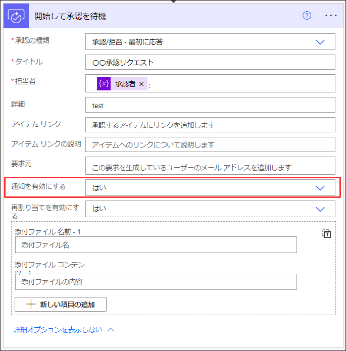
1. [Teams 上で承認アプリが無効化されていないか](https://docs.microsoft.com/ja-jp/microsoftteams/approval-admin#disable-the-approvals-app)ご確認ください。  
1. 上記で解決しない場合、「お問い合わせいただく場合」に記載する情報を添えてサポートチームまでお問い合わせください。　　

**【メール】Power Automate ポータルにて承認が作成されているが、メール通知が届かない場合**
1. フローの実行履歴を確認し、承認アクションが実行中になっているかご確認ください。  
1. フロー編集画面を開き、承認アクションの「通知を有効にする」オプションが「はい」になっていることをご確認ください。  
  
1. [Exchange Online のメール追跡](https://docs.microsoft.com/ja-jp/exchange/monitoring/trace-an-email-message/run-a-message-trace-and-view-results)をご確認いただき、メール送信時にエラーが発生していないかご確認ください。  
検索条件を以下のように設定してください。
   * 送信元が次のユーザー： maccount@microsoft.com
   * 送信先が次のユーザー：＜あて先のメールアドレス＞
   * 期間もしくはタイムゾーン・開始日・終了日はPower Automate承認アクションの実行時間を含むようご設定ください  
1. 上記で解決しない場合、「お問い合わせいただく場合」に記載する情報を添えてサポートチームまでお問い合わせください。

> [!Note]
> 承認が数日遅延する事象が頻発する場合は、１環境内で作成される承認が多すぎるため制限に抵触してエラーが発生してる可能性がございます。  
> 環境を分けて運用することをご検討ください。

#### お問い合わせいただく場合

| 必要な情報 | 
| --- | 
| [フロー実行履歴URL](https://jpdynamicscrm.github.io/blog/powerautomate/helpful-information-for-powerautomate-sr/#%E3%83%95%E3%83%AD%E3%83%BC%E5%AE%9F%E8%A1%8C%E5%B1%A5%E6%AD%B4URL)  | 
| [承認アクションのスクリーンショット](#screenshot-of-approvalaction)| 
| 承認者のUPN／ログインメールアドレス | 
| 通知が届かない製品：Power Automateポータル、Teams承認アプリ、メール | 
| [Power Automateポータルにて、申請者で承認を確認した時のスクリーンショット](#screenshot-of-approval-in-portal) | 
| [Power Automateポータルにて、承認者で承認を確認した時のスクリーンショット](#screenshot-of-approval-in-portal) | 
| 【メールの場合】ExchangeOnline のメール追跡で取得したデータ | 
  
    

### ◆ 承認作業をしたが、承認アクションが承認中のままになっている場合
クラウド製品のため、承認時に一時的なネットワークエラーで承認作業が失敗することがございます。  
再実行で解消するかご確認ください。再実行で解消しない場合、「お問い合わせいただく場合」に記載する情報を添えてサポートチームまでお問い合わせください。

#### 確認手順

**【ポータル】Power Automate ポータルから承認した場合**  
1. Power Automate ポータルからサインアウトし、再度サインインして承認作業が行えるかご確認ください。  

**【Teams】Teamsから承認した場合**  
1. Teamsからサインアウトし、再度サインインして承認作業が行えるかご確認ください。  

**【メール】メールで承認した場合**  
* Web 版の Outlook の場合
   1. Outlook からサインアウトし、再度サインインして承認作業が行えるかご確認ください。
* クライアント版の Outlook 以外の場合
   1. Outlook クライアントを再起動し、承認作業が行えるかご確認ください。

#### お問い合わせいただく場合
※原因究明をご希望される場合は、承認のキャンセルを行う等、データの状況が変わる動作を実施しないでください。

| 必要な情報 | 
| --- | 
| エラーが発生した[フロー実行履歴URL](https://jpdynamicscrm.github.io/blog/powerautomate/helpful-information-for-powerautomate-sr/#%E3%83%95%E3%83%AD%E3%83%BC%E5%AE%9F%E8%A1%8C%E5%B1%A5%E6%AD%B4URL)  | 
| [承認アクションのスクリーンショット](#screenshot-of-approvalaction)| 
| 承認者のUPN／ログインメールアドレス | 
| 承認作業をした製品：Power Automateポータル、Teams承認アプリ、メール | 
| 承認作業をした時刻 | 
| 承認作業時にエラーメッセージが表示されていたかどうか | 
| 承認作業時にエラーメッセージが表示されていた場合、そのエラーメッセージ | 
| 承認作業が完了したことがわかるスクリーンショット | 
| 同じフローにて、同じ承認者で承認作業が実行できるか | 
  

  
### ◆ 承認通知が二重に届いた場合
#### 確認手順
はじめに、 [Power Automateポータル](#screenshot-of-approval-in-portal) にて、承認が二重に作成されているかご確認ください。
* 承認が二重に作成されている場合
   1. フローの実行履歴を確認し、フローや承認アクションが複数回実行されていないかご確認ください。
   1. 同じフローを再送信して同様の事象が発生するかご確認ください。
   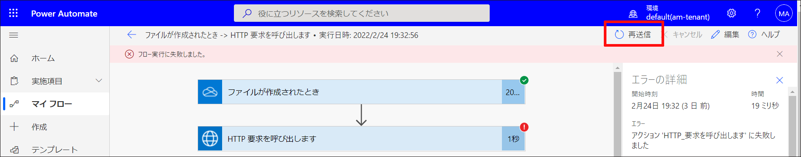
   1. フローの再送信が難しい場合は、同じデータで再度フローを実行いただき事象が発生するかご確認ください。
   1. 手順2,3 で事象が再現しない場合、一時的なエラーにより事象が発生している可能性がございます。  
      一時的なネットワークエラーで承認が2通作成される事象については修正に取り組んでいる状況でございます。  
      内部構造が複雑になっておりすべてのエラーへの対応が完了するまではお時間がかかる見込みでございますので、恐れ入りますが運用回避をご検討いただけますと幸いでございます。
   1. 事象が再現する場合は「お問い合わせいただく場合」に記載する情報を添えてサポートチームまでお問い合わせください。
* 承認が二重に作成されていない場合  
  1. 一時的なネットワークエラーにより、メールまたはTeams通知作成処理でリトライが発生し複数の通知が届いた可能性がございます。  
  一方の承認通知に対して承認作業を実施し、承認フローが次の処理に進むかご確認ください。
  1. 再承認ができない場合や承認フローが進まない場合「お問い合わせいただく場合」に記載する情報を添えてサポートチームまでお問い合わせください。

| 必要な情報 | 
| --- | 
| エラーが発生した[フロー実行履歴URL](https://jpdynamicscrm.github.io/blog/powerautomate/helpful-information-for-powerautomate-sr/#%E3%83%95%E3%83%AD%E3%83%BC%E5%AE%9F%E8%A1%8C%E5%B1%A5%E6%AD%B4URL)  | 
| [承認アクションのスクリーンショット](#screenshot-of-approvalaction)| 
| 承認者のUPN／ログインメールアドレス | 
| 届いた 2 通の承認メール | 

### ◆ 承認メールの表示が異なる
承認コネクタから通知されるメールは、2つの形式で表示されます。  
**(1) メール上で承認作業が行える形式**  
[Outlook のアクション可能なメッセージ](https://docs.microsoft.com/ja-jp/outlook/actionable-messages/)という仕組みを利用して、承認メール上で承認作業を行うことができます。
1. メール上で「承認」ボタンを押します。  
   ※「拒否」の場合も同様です  
   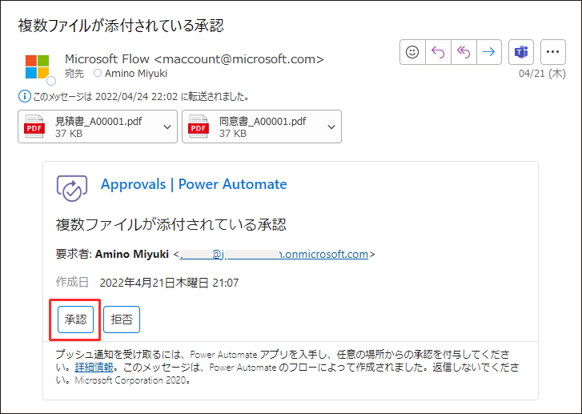
1. コメントを入力し、「送信」ボタンを押すと承認作業が完了します。  
   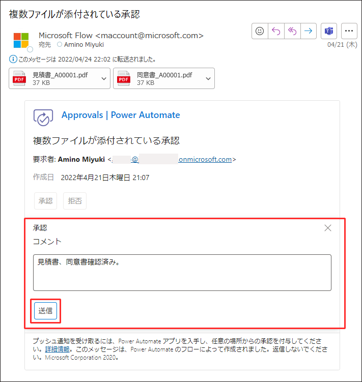

**(2) Power Automate ポータルから承認作業を行う形式**  
「承認」ボタンを押すとPower Automate ポータルへのリンクが表示され、Power Automate ポータル上で承認作業を行います。  
1. メール上で「承認」ボタンを押します。  
   ※「拒否」の場合も同様です  
   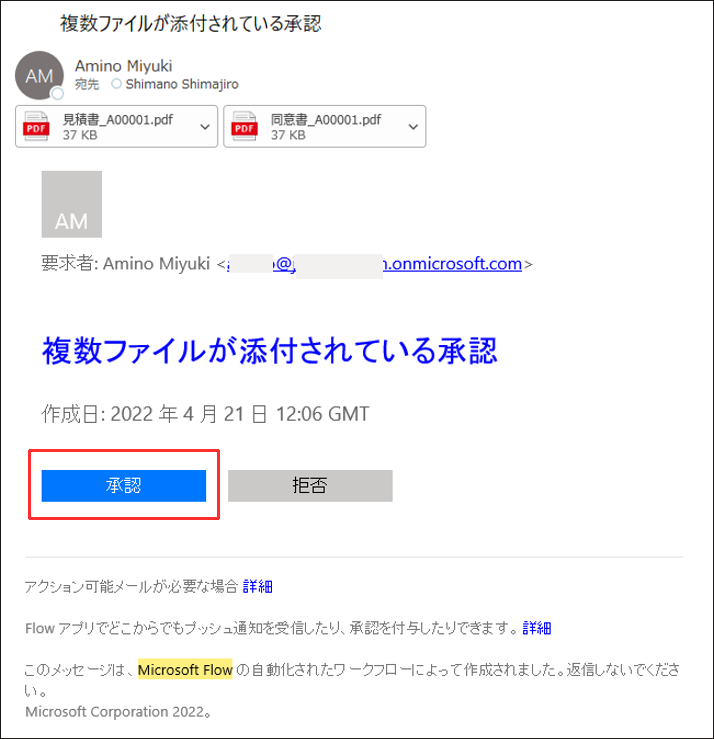
1. Power Automate ポータルに遷移し、ポータル上で承認作業を行います。
   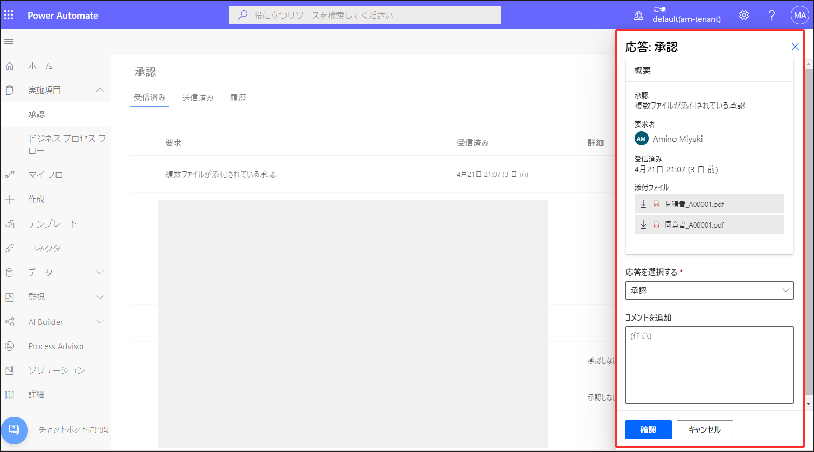

**表示される条件**

| (1) メール上で承認作業が行える形式  |(2) Power Automate ポータルから承認作業を行う形式|
|-- |-- |
|<li>[アクション可能なメッセージがサポートされているバージョンの Outlook ](https://docs.microsoft.com/ja-jp/outlook/actionable-messages/#outlook-version-requirements-for-actionable-messages)を利用している</li><li>ゲストユーザー以外のテナントユーザー</li>|<li>Outlook 以外のメーラーを使用している</li><li>アクション可能なメッセージがサポートされていないバージョンの Outlook を利用している</li><li>承認の担当者がゲストユーザー</li><li>転送された承認メール</li> |

*参考情報*
* [アクション可能なメッセージがサポートされているバージョンの Outlook ](https://docs.microsoft.com/ja-jp/outlook/actionable-messages/#outlook-version-requirements-for-actionable-messages)
* [承認コネクタ](https://docs.microsoft.com/ja-jp/connectors/approvals/#known-issues-and-limitations)

#### (1) のアクション可能なメッセージとして表示されない場合の確認手順
1. 上記の[表示される条件](#condition)に該当しているかご確認ください。
1. [Outlook デスクトップおよび Web のフロー承認電子メールに関する問題](https://support.microsoft.com/ja-jp/topic/outlook-%E3%83%87%E3%82%B9%E3%82%AF%E3%83%88%E3%83%83%E3%83%97%E3%81%8A%E3%82%88%E3%81%B3-web-%E3%81%AE%E3%83%95%E3%83%AD%E3%83%BC%E6%89%BF%E8%AA%8D%E9%9B%BB%E5%AD%90%E3%83%A1%E3%83%BC%E3%83%AB%E3%81%AB%E9%96%A2%E3%81%99%E3%82%8B%E5%95%8F%E9%A1%8C-94f2150a-9a3c-3a9c-8648-2d56567d2373)を確認し、当てはまる場合は対応を行ってください。
1. 上記で解決しない場合、「お問い合わせいただく場合」に記載する情報を添えてサポートチームまでお問い合わせください。

| 必要な情報 | 
| --- | 
| エラーが発生した[フロー実行履歴URL](https://jpdynamicscrm.github.io/blog/powerautomate/helpful-information-for-powerautomate-sr/#%E3%83%95%E3%83%AD%E3%83%BC%E5%AE%9F%E8%A1%8C%E5%B1%A5%E6%AD%B4URL)  | 
| 承認者のUPN／ログインメールアドレス | 
| [「Actionable Message Debugger for Outlook」で取得した情報 ](#actionable-message-debugger)| 

## 承認用お問い合わせ情報取得手順

### 承認アクションのスクリーンショット

  実行履歴に表示される承認アクションのスクリーンショットをご提供ください。  
  スクリーンショットには2点の情報が表示されていることをご確認ください。  
  1. 承認アクションのアクション名
  1. 承認アクションの前後のアクション  
    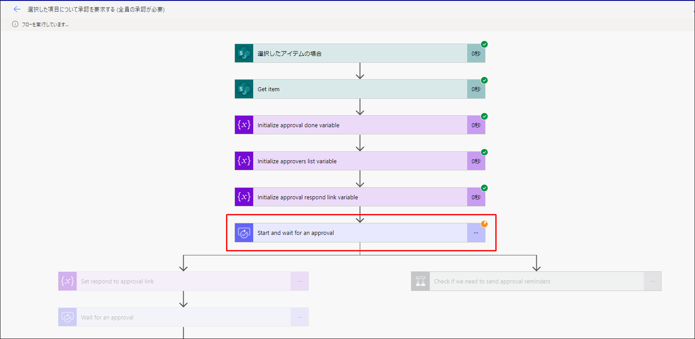

### Power Automate ポータルの承認一覧のスクリーンショット

  実施項目 > 承認 から承認データをご確認いただき、確認した内容がわかるスクリーンショットをご提供ください。  
  * 申請者・・送信済み、履歴タブ
  * 承認者・・受信済み、履歴タブ

  ポータル画面にて表示される内容  
  * 受信済み　…　自分が<u><b>承認者</b></u>となっている、承認待ちの承認一覧です
  * 送信済み　…　自分が<u><b>申請者</b></u>となっている、承認待ちの承認一覧です
  * 履歴　…　自分が承認者または申請者で、完了済みの承認一覧です。※キャンセルされた承認も含まれます。  
     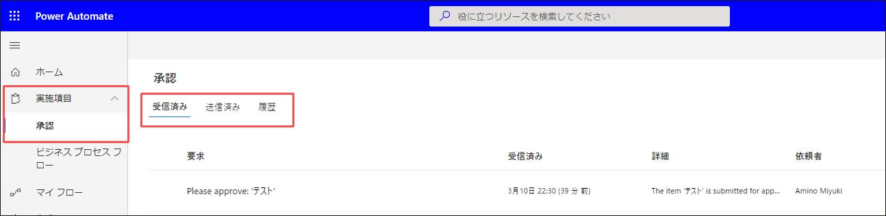

### Power Automate ポータルの承認一覧のスクリーンショット
1. [インストール手順](https://actionablemessagedebugger.azurewebsites.net/)に従い、Actionable Messages Debugger for Outlook をインストールしてください。※英文のみとなります。  
インストールされると以下のように表示されます。   
   * Outlook for the web    
   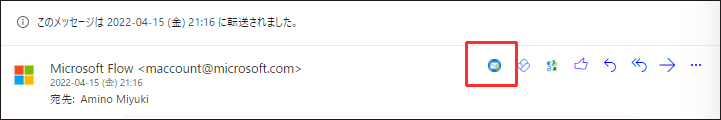  
   * Outlook クライアント
   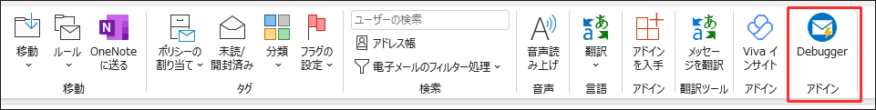  
1. Actionable Messages Debugger 全体のスクリーンショットをご提供ください。  
　※各カードは展開されていない状態で問題ありません。  
  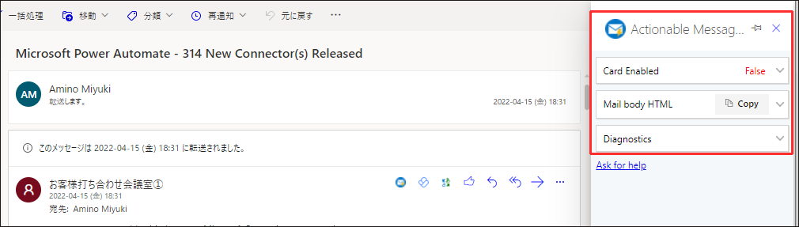  
1. 各カードの<b><u>テキストコピー</u></b>をご送付ください。  
  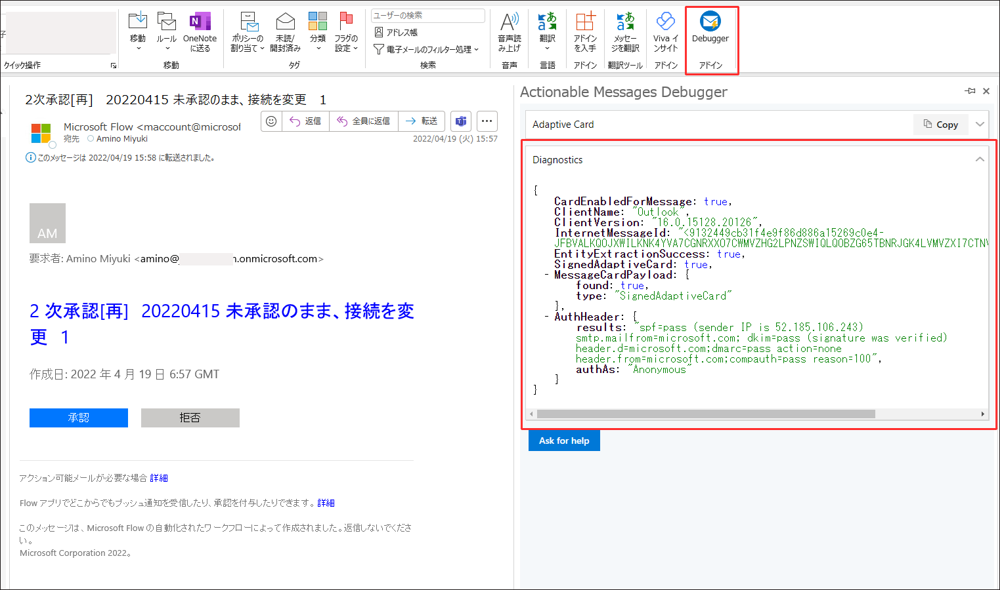  

## 終わりに

Power Automate の承認に関してよくあるお問い合わせについて、確認手順とお問い合わせ時に提供いただきたい情報について記載致しました。  
承認コネクタは2022 年 5 月現在、安定してご利用いただけるよう機能改修を重ねているコネクタでございます。  
今後もデジタルトランスフォーメーションを推進すべく機能改善に努めてまいりますので、今後にご期待いただけますと幸いです。

--