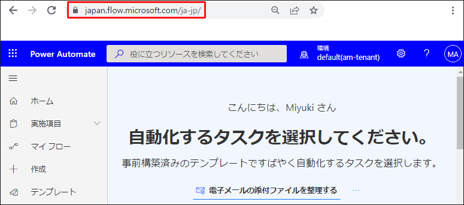
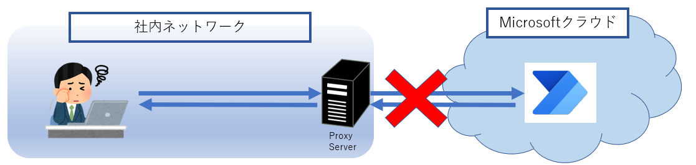
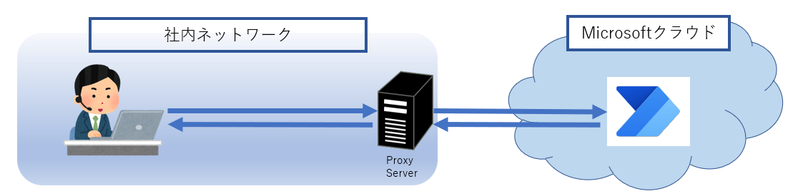
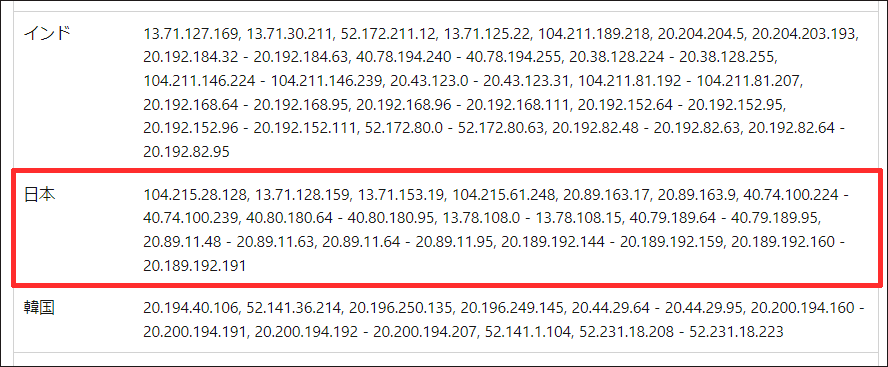

こんにちは、日本マイクロソフト Power Automate サポートの網野です。  
今回はPower Automate 利用時に許可が必要な IP アドレスとドメインについてご案内致します。  
  
本記事の対象者：社内ネットワークから外部サイトへアクセスする際に、接続できる IP や URL を制御しているユーザー / 企業

<!-- more -->
# 目次

1. [概要](#intro)
1. [IP・URLの許可がなぜ必要なのか](#reason)
1. [許可が必要なIP・URL リスト](#ip-url-list)
    1. [Power Automate とデータを送受信する端末](#p-url-list-send-and-recieve)
    1. [Power Automate からデータを受信する端末](#p-url-list-recieve)
1. [FAQ](#faq)
1. [終わりに](#in-summary)

# 概要
Power Automate をご利用いただく際に、許可が必要な IP ・ URL についてご案内致します。  
社内ネットワークから外部サイトへアクセスする時に接続できる IP や URL を制御している場合、Power Automate で利用する指定の IP ・ URL へ接続できるよう許可を行ってください。

> [!IMPORTANT] 
> 本記事は弊社公式ドキュメントの公開情報を元に構成しておりますが、 本記事編集時点と実際の機能に相違がある場合がございます。 
> 最新情報につきましては、参考情報として記載しておりますドキュメントをご確認ください

# IP・URLの許可がなぜ必要なのか
Power Automate は Web サイトを通じてフローを管理する機能を提供しています。  
自分の端末からWeb サイトへは特定のエンドポイントを通じてアクセスします。  
そのため、Power Automate をご利用いただくためには、自端末から Power Automate で利用する IP や URL へアクセスできる必要があります。  

例）  
フローを作成する場合、Power Automate ポータルへアクセスするためのエンドポイント「*.flow.microsoft.com」へアクセスを行います。  
「https://xxxx.flow.microsoft.com」にアクセスできない場合、Power Automate ポータル画面を表示させることができません。  

* 日本リージョンの場合: https://japan.flow.microsoft.com/ja-jp/  
     

例）  
プロキシサーバーでフィルタリングされている場合   
・・・プロキシサーバーでリクエストがブロックされ、 外部サイトである Power Automate にアクセスできません。  
    

例）  
プロキシサーバーでフィルタリングされており、<b><u>Power Automate のエンドポイントを許可している</u></b>場合  
・・・Power Automate で使う IP や URL が許可されているため、Power Automate を利用できます。  
  

社内ネットワークからPower Automate のエンドポイントのアクセス許可が必要かどうかは、各ユーザー / 企業ごとに構築されているネットワーク構成やセキュリティポリシーによって変わります。  
エンドポイントの許可の必要性および許可するための具体的に手順につきましては、貴社のネットワーク担当者にご確認ください。

# 許可が必要なIP・URL リスト

Power Automate との通信が双方向か一方向かによって許可が必要なIP・URLが変わります。  
双方向の場合は受信・送信双方を許可する必要がありますが、受信のみの端末の場合は送信用 IP のみ許可いただければご利用いただけます。
* 双方向 / [Power Automate とデータを送受信する端末](#p-url-list-send-and-recieve)  
・・・Power Automate ポータルへアクセスし、フローを作成する端末などが該当します。
* 一方向 / [Power Automate からデータを受信する端末](#p-url-list-recieve)  
・・・クラウドフローからアクションを通じて接続するサーバーなどが該当します。

リージョンごとに記載がある場合は、ご利用いただいているリージョンの IP と URL をのみ許可してください。  
例）  
  
※「[マネージド コネクタのアウトバウンド IP アドレス](https://docs.microsoft.com/ja-jp/connectors/common/outbound-ip-addresses#power-platform)」から抜粋。最新の情報は公開情報から確認してください。

## Power Automate とデータを送受信する端末
[公開情報](https://docs.microsoft.com/ja-jp/power-automate/ip-address-configuration)に記載されているIPアドレスとドメインを設定してください。「受信 IP」と「送信 IP」両方が記載されている場合は、両方設定します。  

### Web 版の Power Automate 
対象セクション (2022/04/24 時点)
* Logic Apps
* コネクタ
* 必要なサービス
* 承認メールの送信

### Power Automate for Desktop
対象セクション (2022/04/24 時点)
* 必要なサービス
* ランタイムに必要なデスクトップ フロー サービス

## Power Automate からデータを受信する端末
Power Automate からデータを受信のみを行う場合は、[送信に使用するIPアドレス](https://docs.microsoft.com/ja-jp/connectors/common/outbound-ip-addresses)を設定してください。  
Azure Logic Apps、Power Platform の両方設定してください。また、「受信 IP」は設定いただく必要はありません。

## FAQ
### Q. 自社で利用する機能の IP や URL のみ許可することはできますか。
A. Power Automate をご利用いただく場合は、リストに記載されているすべてのIPやドメインを許可する必要があります。一部のみを許可することはサポートされていません。  
　設定時の動作に問題がない場合も、今後の機能開発により急にフローが動作しなくなる可能性がございます。

### Q. どれくらいの頻度で更新されますか。
A. Power Automate におきましては、更新頻度については未定です。

### Q. 更新を確認する方法はありますか。
 [docs.microsoft.com でドキュメントが更新されたときにメールを受け取る](https://powerautomate.microsoft.com/ja-JP/templates/details/4fcdb850e8204ce392f2353830264220/docsmicrosoftcom-%E3%81%A7%E3%83%89%E3%82%AD%E3%83%A5%E3%83%A1%E3%83%B3%E3%83%88%E3%81%8C%E6%9B%B4%E6%96%B0%E3%81%95%E3%82%8C%E3%81%9F%E3%81%A8%E3%81%8D%E3%81%AB%E3%83%A1%E3%83%BC%E3%83%AB%E3%82%92%E5%8F%97%E3%81%91%E5%8F%96%E3%82%8B/)フローのテンプレートを利用し、通知するフローを作成することができます。  
ご要件に合わせてカスタマイズしてご利用ください。※ご利用には[プレミアムコネクタの使用権を含むライセンス](https://docs.microsoft.com/ja-jp/power-platform/admin/power-automate-licensing/types#standalone-plans)が必要です。

### Q. IP や URL を許可する手順を具体的に教えてください。
A. IPやURLをフィルタリングする方法はプロキシサーバー、ファイアウォール、Webフィルタリングツール等、様々ございます。  
　具体的な設定手順は貴社のネットワーク構成や利用しているツールに依存するため、貴社のネットワーク担当者またはツールの提供元にお問い合わせください。

　
## 終わりに

Power Automate をご利用いただく上で許可が必要な IP や URL についてご案内いたしました。  
必要な IP および URL のリストは機能改修に伴い変更されることがございますので、随時公開情報をご確認ください。

--

